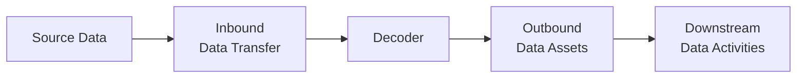

# Decoders
## What is a Decoder?
Decoders restructure and augment inbound data to optimise for query and analysis.  They are installed between standard Google-managed inbound BigQuery data transfers and subsequent transformation, analysis or automation activities.

They efficiently and reponsively curate downstream data assets and are configurable upon deployment, with pre-configured installation functions for connection to specific business intelligence tools. Output data assets can also be exported to a variety of cloud storage providers in any output file/compression format permitted by BigQuery.

They are responsive to newly arriving data in a cost-optimal manner and require minimal ongoing mainenance or monitoring.

## Why are they necessary?
Inbound data structures are typically designed for optimal storage and schema stability, not for simplicity of modelling, query or analytics. Specifically, nested data structures pose challenges as the structure of the nested data needs to be known ahead of time in order to extract meaningful data. This also applies to JSON data.

Historically this has meant that transforming this data required painful hand-crafting of queries with a verbose, unintuitive and uncommon query syntax, slowing down subsequent data-related activities.

Google-managed inbound data transfers also do not arrive at a consistent time every day, which can be challenging to control for efficiently and reliably.

## How do they work?
Decoder installation starts with a profiling stage, to understand the structure, contents and data types of the inbound data, especially the complex (i.e. nested) columns. Based on this profile, decoders deploy a bespoke set of resources which simplify the inbound data structure, augment the inbound data and automate the curation of downstream data assets (typically date-partitioned tables).

These data assets can then be:

- queried directly;
- connected directly to business intelligence tools;
- used as an input to simplified transformation models; and 
- extended with SQL to customise subsequent data transformation.

Decoders are built using a hierarchy of functions and use native (but extended) BigQuery functionality, so do not require external API calls. Decoders can be deployed on whitelisted datasets, by users with the appropriate permissions on the specific installation function.

## Where are they installed?
Decoders are installed in a configurable dataset (within the same region as the inbound data), but typically the same dataset as the inbound data. 

A simple `RUN_FLOW` function is also deployed, which calls an external function to check inbound and outbound metadata, identifying new data partitions and executing transformation logic incrementally on newly-arrived data.  This is triggered on a regular schedule using a simple BigQuery Scheduled Query and can also be called manually to refesh specific partition subsets of the outbound tables.

Automation functions can also only be called by permitted users on whitelisted datasets.

